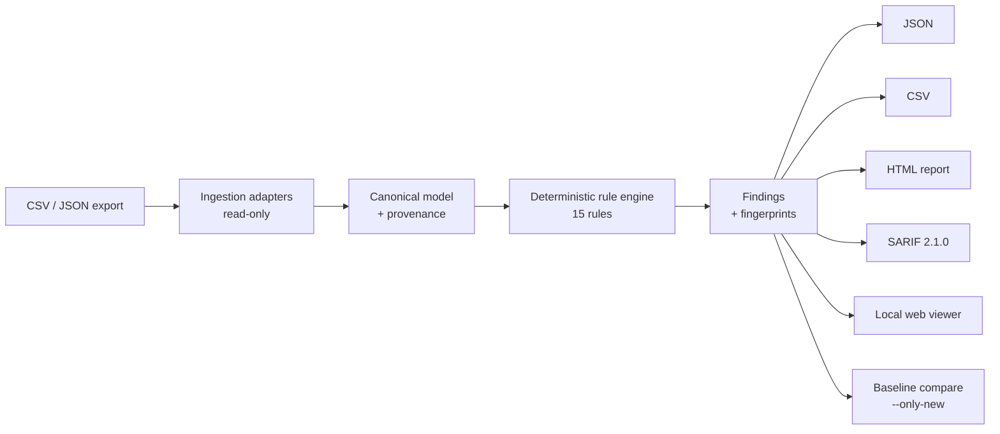

# Collection Integrity CI

> A local-first, offline quality check for museum collection data.

Before a museum moves its collection to a new system, puts it online, or hands it to an aggregator,
someone has to ask an awkward question: does the data actually agree with itself? Are two objects
claiming the same accession number? Is a record marked for publication pointing at rights that
forbid it? Does an object sit in two "current" locations at once?

Collection Integrity CI answers that on a registrar's own laptop. Nothing goes to the cloud, no API
key is required, and no data leaves the machine. It reads a CSV or JSON export, runs a rule engine
over it, and produces findings a person can act on, each one backed by the evidence behind it.

!!! note "What it is not"
    It isn't a collection management system, and it isn't a rights or legal authority. It never edits
    source records; reading is strictly read-only. Think of it as the check that runs before a
    migration, publication, or export, the same way a linter runs before you ship code.

## What it does

- Runs 15 deterministic rules covering identity, references, rights, locations, dates, schema,
  controlled vocabularies, and media. Each one is a documented, versioned check with no network or
  AI calls behind it.
- Writes findings in four formats: JSON, CSV, a self-contained HTML report, and SARIF 2.1.0, so
  results show up natively in GitHub code-scanning.
- Supports baselines and `--only-new`, so a CI job can fail on new regressions while ignoring a
  backlog you already know about.
- Ships a local web viewer (`collection-ci serve`) that is read-only and offline.
- Includes adapters for the Met, Cleveland, and NGA open-data exports, with bounded sampling so you
  never pull a whole dataset by accident.

## See it run

Scanning a deliberately dirty example export shows the problems and exits non-zero, which is the
signal a CI pipeline needs:

```console
$ collection-ci scan --mapping examples/mappings/dirty.yaml --output-dir build/dirty
Scanned 250 object record(s).
                                    Findings
┏━━━━━━━━━━━━━━━━━━━━━━━━━━━━━━━━━┳━━━━━━━━━━┳━━━━━━━━━━━━━━━━━━━━━━━━━━━━━━━━━┓
┃ Rule                            ┃ Severity ┃ Summary                         ┃
┡━━━━━━━━━━━━━━━━━━━━━━━━━━━━━━━━━╇━━━━━━━━━━╇━━━━━━━━━━━━━━━━━━━━━━━━━━━━━━━━━┩
│ CORE001_DUPLICATE_ACCESSION_NU… │ critical │ Accession '1999.21.5-204' is    │
│                                 │          │ used by 2 objects.              │
│ SCHEMA001_INVALID_FIELD_TYPE    │ high     │ production_start_date=          │
│                                 │          │ 'not-a-date' is not a valid     │
│                                 │          │ date.                           │
└─────────────────────────────────┴──────────┴─────────────────────────────────┘

Wrote 20 finding(s) to build/dirty
$ echo $?
1
```

Every finding names the object it's about, the source rows involved, a suggested fix, and a stable
fingerprint. That fingerprint is the identity baselines and "only new" rely on.

## How good are the rules?

The rules aren't assumed to work; they're measured. A benchmark injects labeled errors into a
synthetic dataset and scores each rule against the known answers.

| Metric | Result |
|--------|--------|
| Object-level rules scored | 5 (on 60 synthetic objects, 20 injected errors) |
| Precision | 1.00 on every scored rule |
| Recall | 1.00 on every scored rule |
| F1 | 1.00 on every scored rule |

Run `collection-ci benchmark` and you'll get the same numbers. They're regenerated on every CI run,
so this page can't quietly fall out of date.

## Architecture



The layers have hard boundaries. Ingestion never writes, rules never touch the network, and
formatters never change findings. Tests enforce those boundaries rather than leaving them to good
intentions.

## What it can't do

- The rules check that the data agrees with itself, not that it's true. A clean report means the
  records are internally consistent, not that every date or attribution is correct.
- Rights findings are consistency warnings, not legal advice. The tool is not a rights authority,
  on purpose.
- The benchmark currently exercises a subset of the rules; the rest are covered by unit and
  integration tests. The repository's `docs/FUTURE_SCOPE.md` has the full scope boundary.
- Any future AI-assisted rule would be opt-in and off by default. The core product runs entirely
  offline.

---

If you want to see how it holds up on real museum data, the
[real-data validation](real-data.md) page has the results. For how the project itself was built,
there's the [build case study](how-built.md).
