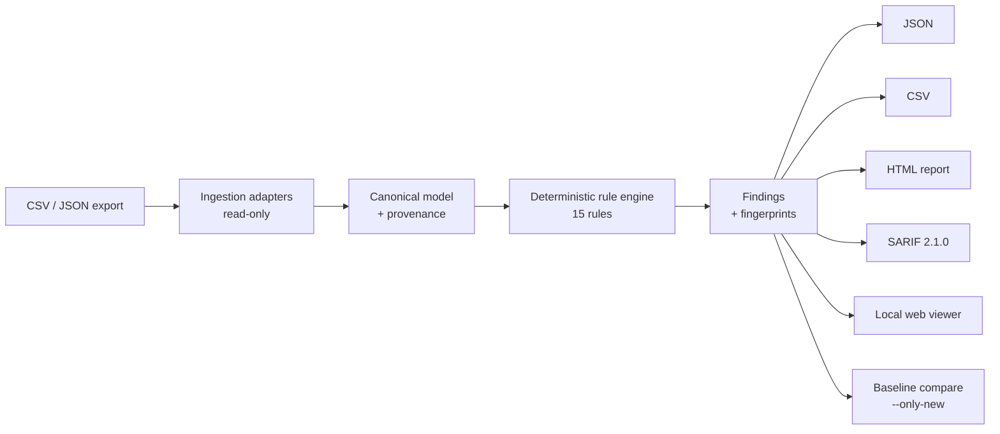

# Collection Integrity CI

> A local-first, offline quality-assurance layer for museum and cultural-heritage collection data.

Before a museum migrates its collection to a new system, publishes it online, or shares it with an
aggregator, someone has to answer an uncomfortable question: **does the data actually agree with
itself?** Are two objects claiming the same accession number? Does a record marked "publish" point
to rights that forbid publication? Does an object sit in two "current" locations at once?

Collection Integrity CI answers that question deterministically, on a registrar's own laptop, with
**no cloud service, no API keys, and no data ever leaving the machine.** It ingests a CSV/JSON
export, runs a transparent rule engine, and produces evidence-backed findings a human can act on.

!!! note "What it is not"
    Not a collection management system, not a rights or legal authority, and it never edits source
    records. Ingestion is strictly read-only. It is a *checking* layer that sits in front of a
    migration, publication, or export — the same role a linter or CI check plays for source code.

## What it does

- **15 deterministic rules** across identity, references, rights, locations, dates, schema,
  controlled vocabularies, and media — each a documented, versioned check with no network or AI
  calls.
- **Evidence-backed findings** in four formats: JSON, CSV, a self-contained HTML report, and
  **SARIF 2.1.0** so results show up natively in GitHub code-scanning.
- **Baselines and `--only-new`**, so a CI gate can fail on *new* regressions while tolerating a
  known backlog.
- **A local web viewer** (`collection-ci serve`) — read-only, offline, server-rendered.
- **Museum source adapters** for the Met, Cleveland, and NGA open-data exports, with bounded
  sampling so you never accidentally download a full dataset.

## See it run

A scan of a deliberately "dirty" example export surfaces its problems and exits non-zero — the
signal a CI pipeline needs:

```console
$ collection-ci scan --mapping examples/mappings/dirty.yaml --output-dir build/dirty
Scanned 250 object record(s).
                                    Findings
┏━━━━━━━━━━━━━━━━━━━━━━━━━━━━━━━━━┳━━━━━━━━━━┳━━━━━━━━━━━━━━━━━━━━━━━━━━━━━━━━━┓
┃ Rule                            ┃ Severity ┃ Summary                         ┃
┡━━━━━━━━━━━━━━━━━━━━━━━━━━━━━━━━━╇━━━━━━━━━━╇━━━━━━━━━━━━━━━━━━━━━━━━━━━━━━━━━┩
│ CORE001_DUPLICATE_ACCESSION_NU… │ critical │ Accession '1999.21.5-204' is    │
│                                 │          │ used by 2 objects.              │
│ SCHEMA001_INVALID_FIELD_TYPE    │ high     │ production_start_date=          │
│                                 │          │ 'not-a-date' is not a valid     │
│                                 │          │ date.                           │
└─────────────────────────────────┴──────────┴─────────────────────────────────┘

Wrote 20 finding(s) to build/dirty
$ echo $?
1
```

Each finding carries the offending entity, the source rows, a remediation, and a stable
**fingerprint** — the identity that makes baselines and "only new" possible.

## How good are the rules?

Correctness is not asserted, it is *measured*. A deterministic benchmark injects labeled errors into
a synthetic dataset and scores each rule against ground truth:

| Metric | Result |
|--------|--------|
| Object-level rules scored | 5 (on 60 synthetic objects, 20 injected errors) |
| Precision | **1.00** on every scored rule |
| Recall | **1.00** on every scored rule |
| F1 | **1.00** on every scored rule |

Run it yourself with `collection-ci benchmark`. The metric is regenerated on every CI run, so this
page can never drift from the truth.

## Architecture



Each layer has a hard boundary: ingestion never writes, rules never call the network, formatters
never mutate findings. Those boundaries are enforced by tests, not convention.

## Honest limitations

- The rules check **internal consistency**, not real-world truth. A clean report means the data
  agrees with itself, not that every date or attribution is correct.
- Rights findings are **policy-consistency warnings, not legal advice.** The tool is deliberately
  not a rights authority.
- Only a subset of rules is currently exercised by the automated benchmark; the rest are covered by
  unit and integration tests. See [`docs/FUTURE_SCOPE.md`](https://github.com/) in the repository
  for the full scope boundary.
- Any future AI-assisted rule is an **opt-in, disabled-by-default** adapter; the core product works
  entirely offline.

---

Curious *how* this was built? The **[loop-engineering case study](how-built.md)** walks through the
working method — and the evidence in the repository that backs every claim on this page.
